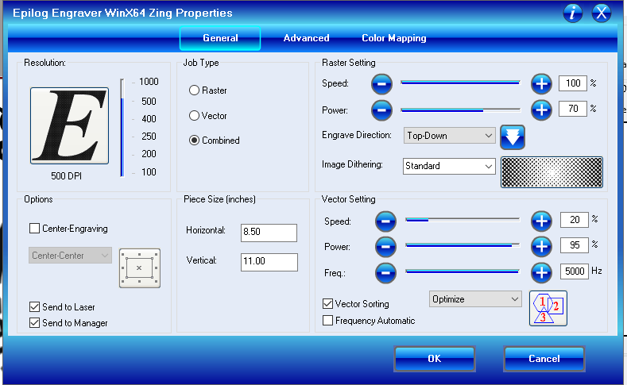
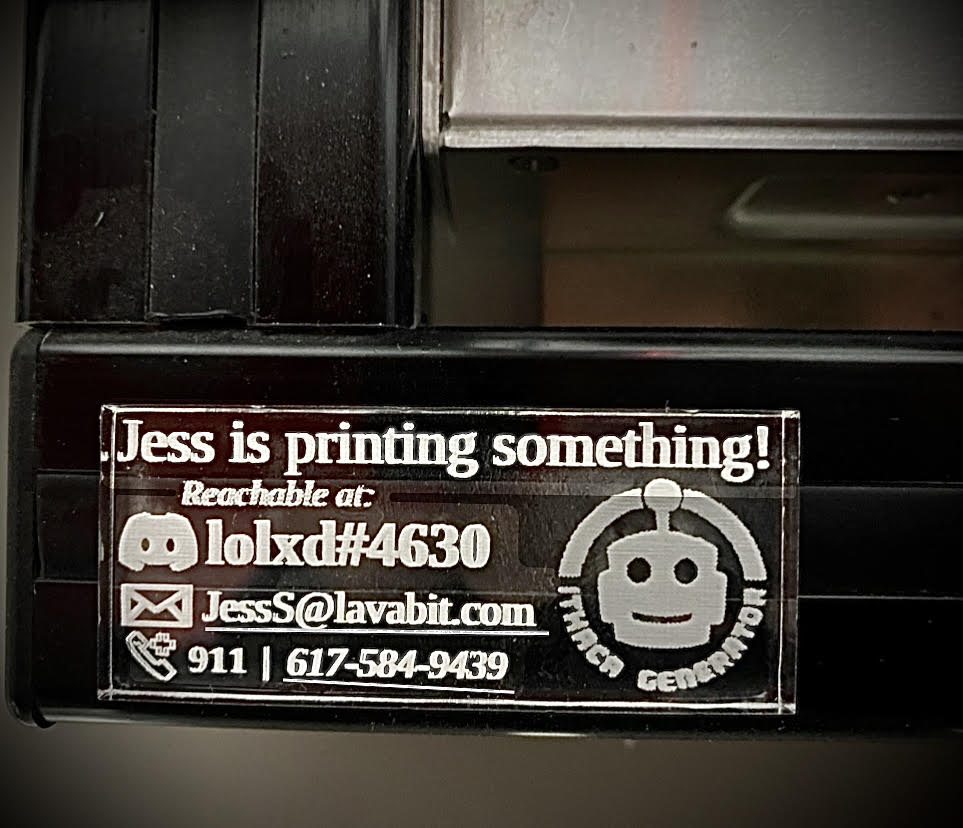

## *Lasercut an "oops, call me or 911" card at Ithaca Generator*

Here is a template to chop out your very own, "these are my shenanigans, if it looks like burning plastic or PLA spaghetti contact me here" card.  

- #### [Download and open](https://raw.githubusercontent.com/Jesssullivan/misc/master/etc/blank911.svg) the file `blank911.svg` in [Inkscape](https://inkscape.org/).  
  - Hit the `T` key to start using the text tool.  Insert your contact stuff (Jess used `Liberation Serif` font fwiw)
  - If you are going to be using a clear material such as an 1/4" acrylic sheet, select everything and hit the `H` key to flip everything horizontally prior to printing.
  - Save your file as a PDF, then open it in adobe acrobat so we can muck around with the print settings.  (There has got to be a better way to access that Zing printer preferences box than with adobe acrobat.... Hmm)
  - Using the "Combined" Job Type, fiddle with both the raster and vector settings- for acrylic at 500 dpi, use: Raster: 100% speed, 70% power, Vector: 20 speed, 95 power, 5000 hz.
 

### Tada!

